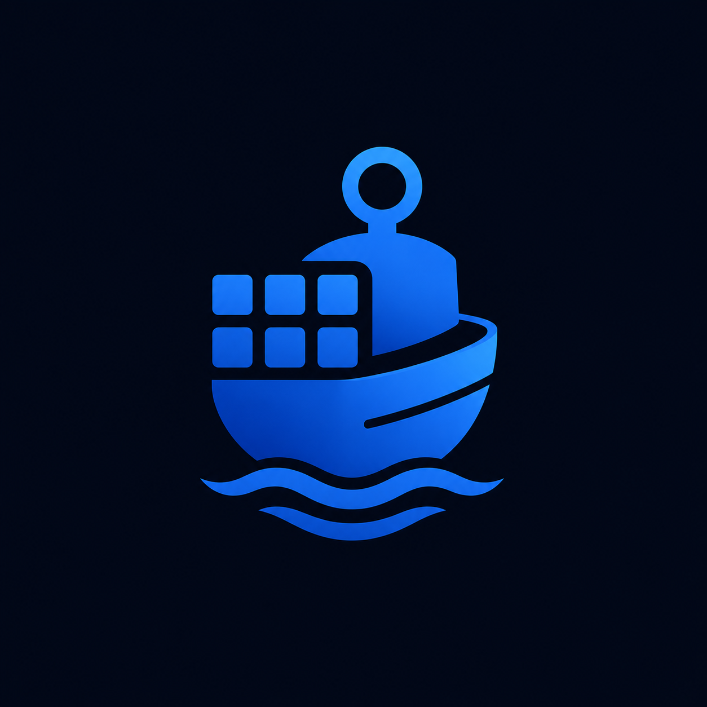

  
  <h1>Buoy</h1>
  
<strong>Your bots, managed.</strong>

  
  

    

## What is Buoy?

You wrote a bot. Now you need to keep it running. Opening a terminal, running `node index.js`, and praying it doesn't crash is not a workflow. Buoy is a desktop app that handles all of that for you — start, stop, monitor, and auto-restart your bots without touching the command line.

## What Buoy Does

- **Keeps bots alive** — If your bot crashes, Buoy restarts it automatically
- **One-click start/stop** — No more terminals. No more `Ctrl+C` accidents
- **Installs dependencies** — `npm install` or `pip install` from a button click
- **Logs at a glance** — Real-time stdout and stderr, with auto-cleanup after 7 days
- **Secure env vars** — API tokens and secrets encrypted in the app, injected at runtime
- **Minimize to tray** — Close the window, your bots keep running in the background
- **Auto-restore on launch** — Reopen Buoy and it picks up where you left off

## Getting Started

1. Download and install Buoy
2. Click **Add Bot** and point it to your project folder
3. Set your environment variables (tokens, API keys)
4. Hit **Start** — done.

## Requirements

- Node.js or Python installed on your system (for running bots)
- Your bot code with a valid `package.json` or `requirements.txt`

## Download

Grab the latest installer from the [Releases](../../releases) page.

> **Windows**: Run the `.msi` installer and launch Buoy from the Start menu.  
> **macOS / Linux**: See releases for `.dmg` and `.AppImage` builds.

## Screenshots

<!-- TODO: Add screenshots -->

## License

MIT
